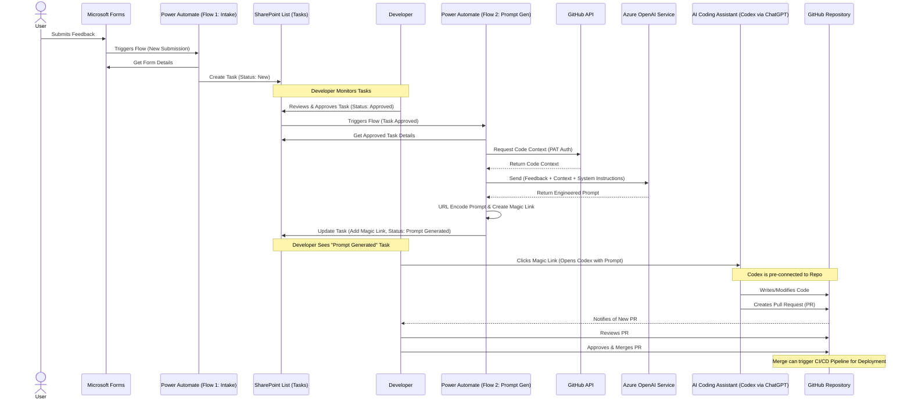

# AI Assisted Feedback to Feature
This shows how feedback from users is captured, processed, and turned into actionable code changes through a series of automated steps involving 
Microsoft Forms, Power Automate, SharePoint, GitHub, and Azure OpenAI. 

The developer interacts with the system primarily through SharePoint tasks and GitHub for code changes.

Example: https://youtu.be/dL0uvPXYi28?si=wwDeJE52O3dX1hb9 

## Flow

