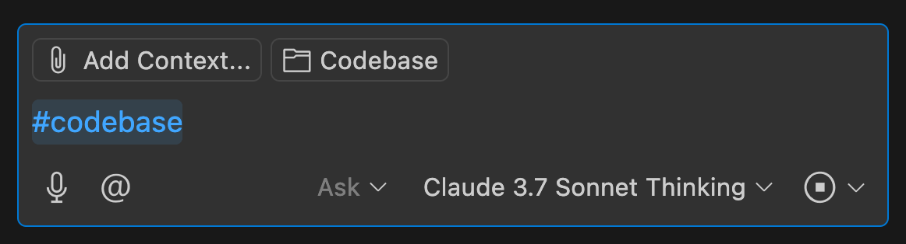

# Essential AI Prompts for Developers using VS Code
https://youtu.be/0xZ1vLUSQl8?si=hUJbqg_nzU3MjKbM

## Modes for Copilot
- Ask
- Edit
- Agent

## Ask
- Q and A prompts
- Pros and Cons prompts
- Step-wise chain of thought prompts
- Role play prompts

### Examples
#### Ask it to write script to generate appropriate project structure
This helps you see the result before you actually create the files.

## Agent Mode
This directly creates the files in your project.

## Terms
- #codebase: Allows Copilot to access the entire codebase.

  

## Tips
- Clean your chat history often.

### Refactoring
Refactors are usually multiple steps and the next step depends on the previous one.
So the model tends to get confused.
Use something called "Step-wise chain of thought" to make the model not do that.

For eg:
"Hey I want to refactor this code.
Move 1 step at a time.
Do not move to the next step until I give you the key word: banana."

### Role Play
"You are the greatest instruction instructor in the world.

What makes you so exceptional is your ability to give students creative exercises that help them learn by doing. 
Your class is the most popular in school—everyone loves it.

Today, you're teaching a class on regular expressions (regex).

Start the class and move through one exercise at a time.
If a student gets an answer wrong, do not give them the correct answer. 
Instead, offer a helpful suggestion that nudges them toward the right solution."

