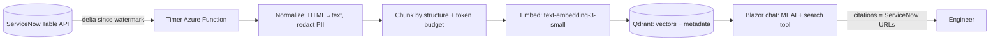

# RAG interview prep

Answers I should be able to give and defend. Each answer states the trade-off, not just the choice. Every claim here should match what I actually built, either at work or in this repo.

## Model choices

### Why `text-embedding-3-small`?
- **Good enough quality for the domain.** IT knowledge articles, tickets and policy documents are plain business English. On retrieval benchmarks, `-small` sits close to `-large`.
- **Cost:** about $0.02 per 1M tokens, roughly 6.5× cheaper than `text-embedding-3-large`. Re-embedding the whole corpus, for example after changing the chunking or the model, stays cheap, which makes it easier to iterate.
- **Storage and speed:** 1536 dimensions vs 3072 for `-large`. That halves the vector storage and makes similarity search faster.
- **Decided with data, not by default.** I'd build a small "golden set" of real questions, each paired with the article or ticket that answers it. I measure **recall@k**: is the right chunk in the top 5? If `-small` and `-large` score about the same, take the cheaper one. Switch only if the eval shows a real gap.
- **Plan for change.** The embedding model is part of the index's identity. Changing it means re-embedding everything, because vectors from different models can't be compared. Ingestion is idempotent and automated, so a re-embed is just one job run into a new collection, followed by a swap.

### Why a "mini" chat model?
- In RAG, the model mostly **reads the retrieved text and summarizes it**; it doesn't need to bring knowledge of its own. A mini model handles that well, at a fraction of the cost and latency of a larger one.
- It needs reliable **tool calling**, because the model decides when to search.
- **SKU:** Global Standard is cheapest. Choose Data Zone Standard or Standard when processing must stay in the US, as with client confidentiality.
- The app asks for the **deployment name** (`chat`), not a specific model. When a model is retired, swapping it is a configuration change.

## Chunk size: how I decide

**Tokens:** the unit an LLM reads and writes. A token is a word, part of a word, or punctuation. In English, roughly **100 tokens ≈ 75 words**. Prices, context windows and chunk sizes are all measured in tokens.

**Too small** (e.g. 100 tokens):
- A chunk lacks the surrounding context needed to answer ("Restart the service." Which service? Why?).
- You need more chunks per answer, and the model has to stitch them together.

**Too large** (e.g. 3000 tokens):
- **The embedding gets diluted.** One vector has to represent many topics, so it matches none of them strongly, and retrieval precision drops. *This is the main reason, more than the context window.*
- **Cost and latency:** every question sends top-k × chunk size tokens to the model.
- **Lost in the middle:** models attend less reliably to text buried in long contexts.
- Context window limits matter too: question + system prompt + retrieved chunks + conversation history + room for the answer must all fit. But with 128K+ windows, cost and precision usually become the constraint first.

**What I use:**
- **Structure first:** split on headings or sections, and on ticket fields and comment entries, so chunks follow the document's natural meaning.
- **Then a token budget:** about **300–800 tokens** per chunk, with **10–15% overlap**, so a thought split at a boundary still appears whole in one chunk.
- **Never split a table mid-row.**
- **Validate with the golden set.** Chunk size is a tuning knob, not a guess.

**For reference:** this app's chunker (`Microsoft.Extensions.DataIngestion`) defaults to 2000 max tokens with 500 overlap. That's on the large side for precise retrieval.

## ServiceNow RAG: design deep-dive

**Goal:** engineers ask "How do I fix X?" and get a cited answer drawn from KB articles and similar resolved tickets.

### Ingestion (scheduled, incremental)
- **Timer-triggered Azure Function** (e.g. every 15 minutes). It's separate from the web app, so a slow or failing ingestion never affects chat.
- **ServiceNow Table API**, reading only what changed: `sysparm_query=sys_updated_on>{lastWatermark}`, paged with `sysparm_limit` and `sysparm_offset`. The watermark is stored after each successful run, so the job is restartable and catches up after an outage.
- **Stable IDs:** the document ID is the record's `sys_id`. The chunk key is a deterministic GUID made from `sys_id + chunk index`. Re-running **replaces** chunks instead of duplicating them.
- **Content hash:** skip re-embedding when the normalized text hasn't changed. Updates in ServiceNow often only touch fields we don't index.
- **Changes and deletes:**
  - An article is updated → delete its old chunks and insert the new ones.
  - An article is retired, unpublished, or past its `valid_to` date → delete its chunks.
  - A ticket is reopened, or new comments arrive → rebuild that ticket's document.
- **Auth to ServiceNow:** OAuth client credentials, with the secret in Key Vault, accessed via managed identity. The integration user is read-only and scoped to the tables we need.

### KB articles (`kb_knowledge`)
- Convert the HTML body to clean text or Markdown, and keep the headings.
- Chunk **by heading**, then by token budget. Put the heading path in `context`, e.g. `VPN Troubleshooting > Mac > Certificate errors`.
- **Metadata:** `number` (KB0012345), `title`, `kb_knowledge_base`, `kb_category`, `sys_updated_on`, `valid_to`, `workflow_state`, `url`, and access groups (from the KB's user criteria).

### Tickets (INC, REQ, RITM, CHG)
- **Index only resolved or closed tickets that have a meaningful resolution.** Open tickets don't contain answers yet.
- **One ticket = one logical document**, written as **Problem → Diagnosis → Resolution**:
  - header: number, short description, CI or service, category, assignment group
  - `description`
  - the relevant `work_notes` and `comments` from the `sys_journal_field` journal, in chronological order, with noise filtered out ("Any update?", auto-notifications, SLA messages)
  - `close_notes` (the resolution), which is the most valuable part
- **Most tickets fit in one chunk.** For long tickets, split by journal entries and repeat the ticket header in `context`, so every chunk still knows which ticket it belongs to.
- **Optional enrichment:** use an LLM to summarize each ticket into a clean Problem / Cause / Fix record before embedding. Retrieval improves a lot, at a small one-time cost per ticket. I'd measure the gain on the golden set before turning it on everywhere.
- **PII redaction before embedding:** names, emails, phone numbers and credentials pasted into tickets. Use regex plus a PII detector (e.g. Azure AI Language PII).
- **Metadata:** `number`, `type` (INC/REQ/RITM/CHG), `state`, `priority`, `cmdb_ci`/service, `assignment_group`, `opened_at`, `resolved_at`, `url`.

**Why store ticket numbers as metadata?**
- Users type exact identifiers ("INC0012345", error codes). Vector search is weak at exact matches.
- Index the number as a filterable field, and use **hybrid search** (keyword + vector) so exact IDs and error strings rank first.
- Citations show the number and link straight to the record in ServiceNow.

### Screenshots and attachments (`sys_attachment`)
- **Default:** don't embed images. Link to the attachment from the ticket's citation.
- **If screenshots carry the answer**, e.g. error dialogs:
  - Run OCR (Document Intelligence `prebuilt-read`) or have a vision-capable model write a caption.
  - Embed that text as a chunk with `source = attachment` and a link to the image.
- It costs more per image, so I'd do it only for ticket categories where it measurably helps.

### Retrieval and answers
- The search tool filters by the **user's groups** (security trimming), plus optional filters for type, service, or recency.
- Retrieve the top-k across KBs and tickets. Prefer KB articles (curated) over tickets (anecdotal) when they conflict. Show the source type in the citation.
- Answers cite the KB or ticket number with its ServiceNow URL. If nothing relevant is found, say so; don't guess.

### Quality and operations
- **Evaluation:** the golden set (real questions → the expected KB or ticket), measured for retrieval recall@k, plus groundedness and relevance (`Microsoft.Extensions.AI.Evaluation`). Run it in CI whenever chunking, prompts or models change.
- **Observability:** OpenTelemetry traces (tool call → embedding → vector search → completion), token usage per request, and a cost dashboard.
- **Feedback:** thumbs up/down per answer, which feeds new golden-set items.

## What a law-firm RAG needs (beyond the basics)
Covered by the build plan:
1. Idempotent, scheduled ingestion (Azure Function).
2. Provenance: page, region, and section heading per chunk (Document Intelligence).
3. Security trimming (ethical walls) at retrieval, **and** on the source-file endpoint.
4. Chunk-ID citations that open the exact page and highlight the passage.

Also expected, and worth naming:

5. **Hybrid search + reranking.** Legal text depends on exact terms (case names, statute sections, matter numbers). Vector search alone misses them.
6. **Evaluation** in CI: retrieval recall, groundedness, and relevance.
7. **Guardrails:** content safety, prompt-injection defenses (retrieved text is *data*, not instructions), and "answer only from sources".
8. **Audit logging:** who asked what, which documents were retrieved and shown. Firms need this for compliance.
9. **Data residency:** Data Zone or Standard SKUs, with no training on customer data (Azure OpenAI's default).
10. **Retention and deletion:** when a matter closes or a document is deleted, its chunks are removed too.

**Mixing API sources and files is the strong story:** "I built ingestion connectors for both structured API data (ServiceNow) and unstructured documents (PDF, Word), normalized them into one chunk schema with provenance and access metadata, and served them through one permission-aware search tool."
