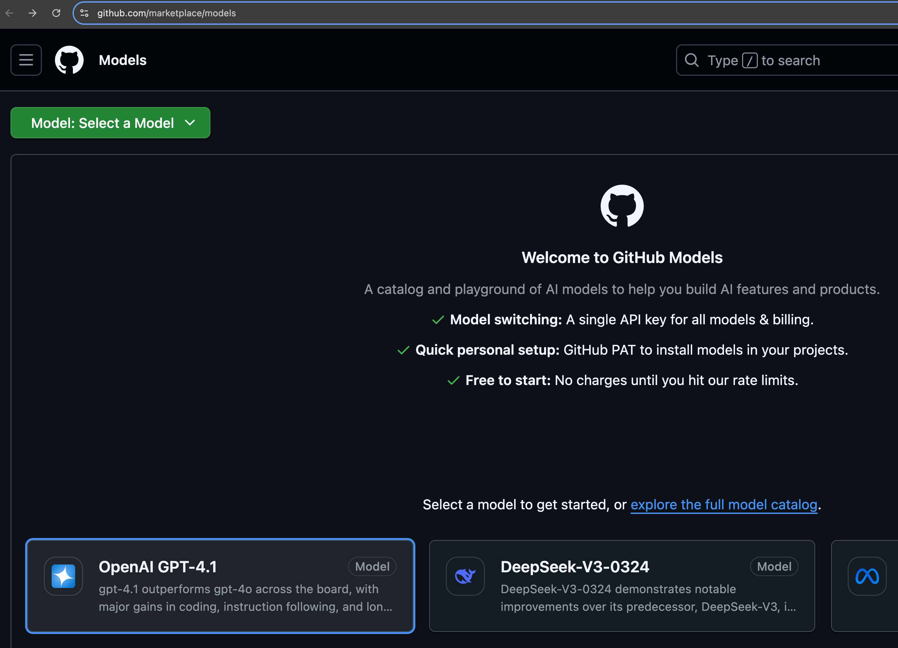
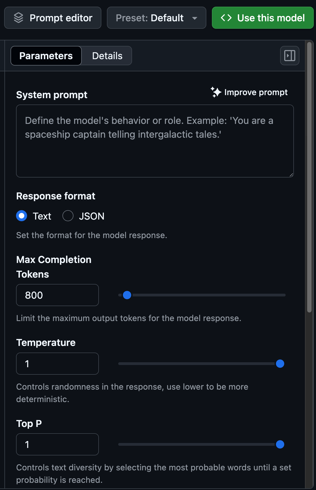
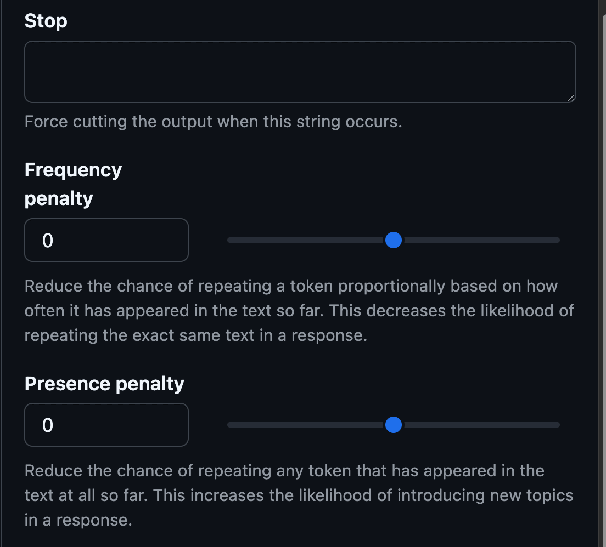
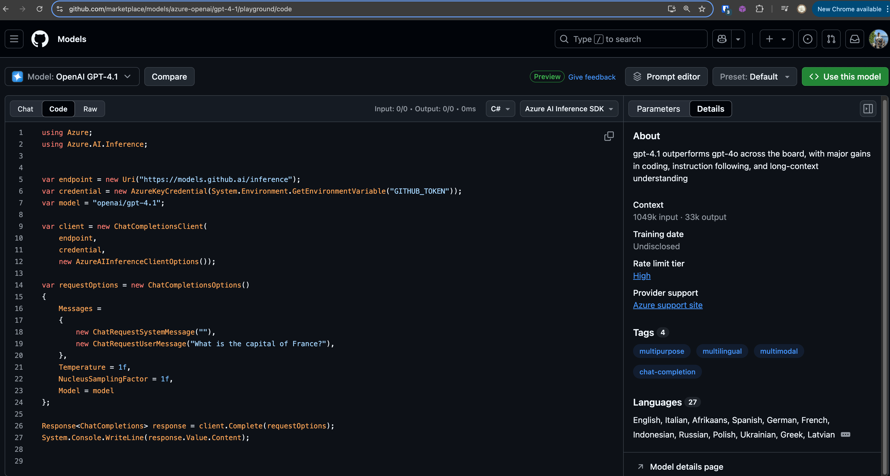
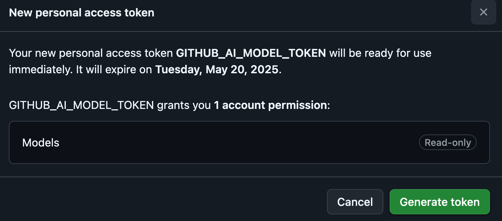
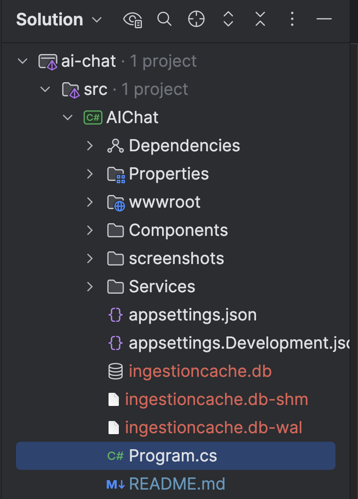
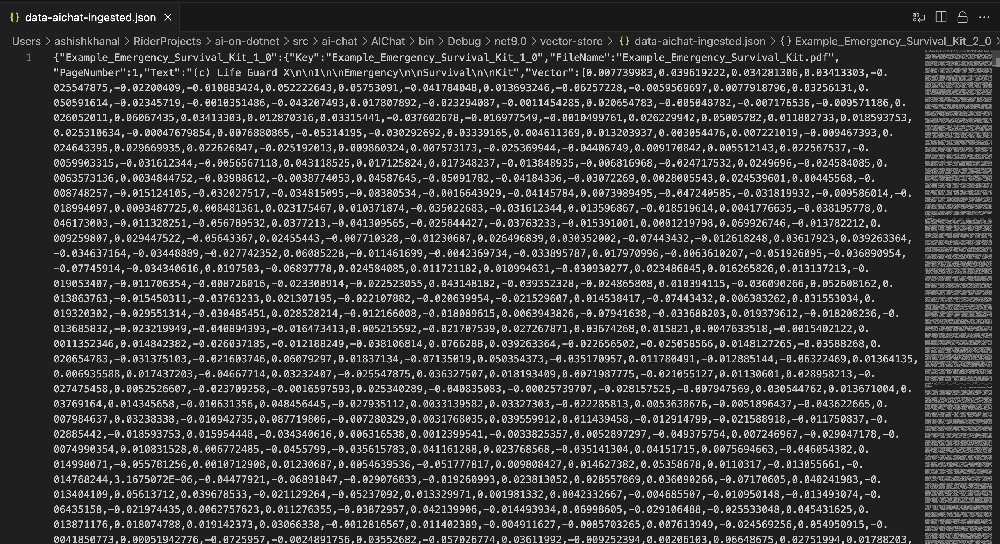
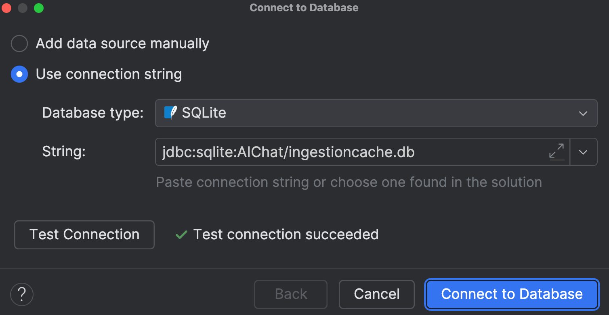
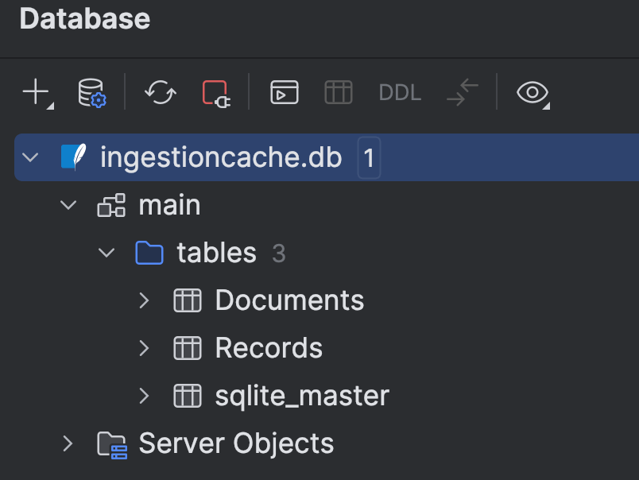
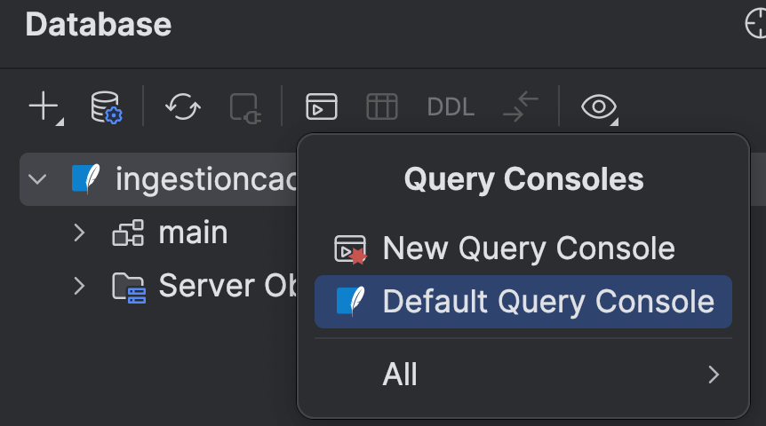

# AI Chat with Custom Data
This project is an AI chat application that demonstrates how to chat with custom data using an AI language model.  

## Resources
- Watch the video and follow along with docs below:
    - [ASP.NET Community Standup - AI-powered Blazor web apps with the new .NET AI template](https://www.youtube.com/live/9cwSOyavdSI?si=ddZfiNBftdWDEHjv)
    - [Create a .NET AI app to chat with custom data using the AI app template extensions](https://learn.microsoft.com/en-us/dotnet/ai/quickstarts/ai-templates?tabs=dotnet-cli%2Cconfigure-visual-studio&pivots=github-models)

## Install AI app template
```bash
$ dotnet new install Microsoft.Extensions.AI.Templates
The following template packages will be installed:
   Microsoft.Extensions.AI.Templates

Success: Microsoft.Extensions.AI.Templates::9.4.0-preview.2.25216.9 installed the following templates:
Template Name    Short Name  Language  Tags                            
---------------  ----------  --------  --------------------------------
AI Chat Web App  aichatweb   [C#]      Common/AI/Web/Blazor/.NET Aspire
```

Check out the options using help flag.
```bash
$ dotnet new aichatweb -h
AI Chat Web App (C#)
Author: Microsoft
Description: A project template for creating an AI chat application, which uses retrieval-augmented generation (RAG) to chat with your own data.

Usage:
  dotnet new aichatweb [options] [template options]

Options:
  -n, --name <name>       The name for the output being created. If no name is specified, the name of the output directory is used.
  -o, --output <output>   Location to place the generated output.
  --dry-run               Displays a summary of what would happen if the given command line were run if it would result in a template creation.
  --force                 Forces content to be generated even if it would change existing files.
  --no-update-check       Disables checking for the template package updates when instantiating a template.
  --project <project>     The project that should be used for context evaluation.
  -lang, --language <C#>  Specifies the template language to instantiate.
  --type <project>        Specifies the template type to instantiate.

Template options:
  -F, --Framework <net9.0>                             The target framework for the project.
                                                       Type: choice
                                                         net9.0  Target net9.0
                                                       Default: net9.0
  --provider <azureopenai|githubmodels|ollama|openai>  Type: choice
                                                         azureopenai   Uses Azure OpenAI service
                                                         githubmodels  Uses GitHub Models
                                                         ollama        Uses Ollama with the llama3.2 and all-minilm models
                                                         openai        Uses the OpenAI Platform
                                                       Default: githubmodels
  --vector-store <azureaisearch|local|qdrant>          Type: choice
                                                         local          Uses a JSON file on disk. You can change the implementation to a real vector database before publishing.
                                                         azureaisearch  Uses Azure AI Search. This also avoids the need to define a data ingestion pipeline, since it's managed by Azure AI Search.
                                                         qdrant         Uses Qdrant in a Docker container, orchestrated using Aspire.
                                                       Default: local
  --managed-identity                                   Use managed identity to access Azure services
                                                       Enabled if: (!UseAspire && VectorStore != "qdrant" && (AiServiceProvider == "azureopenai" || 
                                                       AiServiceProvider == "azureaifoundry" || VectorStore == "azureaisearch"))
                                                       Type: bool
                                                       Default: true
  --aspire                                             Create the project as a distributed application using .NET Aspire.
                                                       Type: bool
                                                       Default: false
  -C, --ChatModel <ChatModel>                          Model/deployment for chat completions. Example: gpt-4o-mini
                                                       Type: string
  -E, --EmbeddingModel <EmbeddingModel>                Model/deployment for embeddings. Example: text-embedding-3-small
                                                       Type: string
```

### Terminology
1. AI service provider (`--provider`)
    - The service that provides the AI model. For example, OpenAI, GitHub Models, Azure OpenAI, etc.
2. Vector store (`--vector-store`)
    - Place to store information that can be retrieved by the AI system using Semantic search.

## Create .NET AI app
```bash
$ cd src/ai-chat
$ pwd
/Users/ashishkhanal/RiderProjects/ai-on-dotnet/src/ai-chat
$ dotnet new aichatweb --Framework net9.0 --provider githubmodels --vector-store local --name AIChat

# https://learn.microsoft.com/en-us/dotnet/core/tools/dotnet-sln#examples
# My previous project: https://github.com/akhanalcs/cs-coding-interview/blob/main/README.md#setup-project
$ dotnet new sln
$ dotnet sln add AIChat/AIChat.csproj --solution-folder src
Project `AIChat/AIChat.csproj` added to the solution.
```

Open the solution by right-clicking `ai-chat.sln` > Open Solution.

## Configure AI model provider (I had chosen `githubmodels`)
https://docs.github.com/en/github-models/prototyping-with-ai-models#experimenting-with-ai-models-using-the-api

### Taking a look around
Go to models marketplace and select a model.



After you select the model, it opens the AI model playground which is a free resource that allows you to adjust model parameters and submit prompts to see how a model responds.
It allows you to experiment with different models and parameters to find the best fit for your use case.

To adjust parameters for the model, in the playground, select the Parameters tab in the sidebar.
1. Frequency Penalty (think of it like penalizing because of frequent same text in the response)
    - This decreases the likelihood of repeating the exact same text in a response.
2. Presence Penalty (think of it like penalizing because of presence of same text in the response)
    - This increases the likelihood of introducing new topics in a response.

<p>
  
&nbsp;
  
</p>

To see code that corresponds to the parameters that you selected, switch from the Chat tab to the Code tab.



### Using the model
Click > **Use this model** in the top right corner of the model page.

To use models hosted by GitHub Models, you will need to create a GitHub personal access token.

Steps. [Reference](https://docs.github.com/en/authentication/keeping-your-account-and-data-secure/managing-your-personal-access-tokens#creating-a-fine-grained-personal-access-token)
- Go to https://github.com/settings/personal-access-tokens
- Token name: `GITHUB_AI_MODEL_TOKEN`, Description: `Token to authenticate with the GitHub AI model.`
- Expiration: 30 days.
- Repository access: Only select repositories > `ai-on-dotnet` (this repository).
- Permissions: Account permissions > Models > Access: Read-only.
- Click **Generate token**.

  
- Copy the token. You won't be able to see it again.
- From the command line, set token for this project using .NET User Secrets by running the following commands:
  ```sh
  $ cd AIChat
  $ dotnet user-secrets set GitHubModels:Token <YOUR-TOKEN>
  ```
- Right click project > Tools > .NET User Secrets. It opens up `secrets.json` file. Verify that the token is set.
  ```json
  {
    "GitHubModels:Token": "github_pat_..."
  }
  ```

## Run the app
Click the green play button in Rider to run the app.


The console will show the following output:
```bash
/Users/ashishkhanal/RiderProjects/ai-on-dotnet/src/ai-chat/AIChat/bin/Debug/net9.0/AIChat
info: AIChat.Services.Ingestion.DataIngestor[0]
      Processing Example_Emergency_Survival_Kit.pdf
info: AIChat.Services.Ingestion.DataIngestor[0]
      Processing Example_GPS_Watch.pdf
info: AIChat.Services.Ingestion.DataIngestor[0]
      Ingestion is up-to-date
info: Microsoft.Hosting.Lifetime[14]
      Now listening on: https://localhost:7080
info: Microsoft.Hosting.Lifetime[14]
      Now listening on: http://localhost:5068
info: Microsoft.Hosting.Lifetime[0]
      Application started. Press Ctrl+C to shut down.
info: Microsoft.Hosting.Lifetime[0]
      Hosting environment: Development
info: Microsoft.Hosting.Lifetime[0]
      Content root path: /Users/ashishkhanal/RiderProjects/ai-on-dotnet/src/ai-chat/AIChat
```

Some files are generated in the `AIChat` folder:



## Check out the code
### Program.cs
Embeddings are vector representations of text that capture semantic meaning, allowing for similarity comparisons
between different pieces of text. The embedding generator converts text into these numerical vectors.

```csharp
// The system ingests documents (like PDFs), converts their content to embeddings, stores them, and then can find
// semantically related content when needed.
var embeddingGenerator = ghModelsClient.GetEmbeddingClient("text-embedding-3-small").AsIEmbeddingGenerator();
```

```csharp
var vectorStore = new JsonVectorStore(Path.Combine(AppContext.BaseDirectory, "vector-store"));
```
Check the file in `/ai-on-dotnet/src/ai-chat/AIChat/bin/Debug/net9.0/vector-store/data-aichat-ingested.json`.



The vector store is used to persistently store vector embeddings for your document data that's being ingested 
from the PDF files mentioned here:
```csharp
// In program.cs
await DataIngestor.IngestDataAsync(app.Services, new PDFDirectorySource(Path.Combine(builder.Environment.WebRootPath, "Data")));
```

Check out the ingestion cache database.

<p>
  
&nbsp;
  
&nbsp;
  
</p>

Query Consoles > Default Query Console



```sql
Select *
From Documents
```
<details>
  <summary>Query result</summary>

| Id | SourceId | Version |
| :--- | :--- | :--- |
| Example\_Emergency\_Survival\_Kit.pdf | PDFDirectorySource:/Users/ashishkhanal/RiderProjects/ai-on-dotnet/src/ai-chat/AIChat/wwwroot/Data | 2025-04-20T20:22:58.5601402Z |
| Example\_GPS\_Watch.pdf | PDFDirectorySource:/Users/ashishkhanal/RiderProjects/ai-on-dotnet/src/ai-chat/AIChat/wwwroot/Data | 2025-04-20T20:22:58.5663617Z |

</details>

```sql
Select *
From Records
```

<details>
  <summary>Query result</summary>

| Id | DocumentId |
| :--- | :--- |
| Example\_Emergency\_Survival\_Kit\_1\_0 | Example\_Emergency\_Survival\_Kit.pdf |
| Example\_Emergency\_Survival\_Kit\_10\_0 | Example\_Emergency\_Survival\_Kit.pdf |
| Example\_Emergency\_Survival\_Kit\_10\_1 | Example\_Emergency\_Survival\_Kit.pdf |
| Example\_Emergency\_Survival\_Kit\_10\_2 | Example\_Emergency\_Survival\_Kit.pdf |
| Example\_Emergency\_Survival\_Kit\_10\_3 | Example\_Emergency\_Survival\_Kit.pdf |
| Example\_Emergency\_Survival\_Kit\_11\_0 | Example\_Emergency\_Survival\_Kit.pdf |
| Example\_Emergency\_Survival\_Kit\_11\_1 | Example\_Emergency\_Survival\_Kit.pdf |
| Example\_Emergency\_Survival\_Kit\_11\_2 | Example\_Emergency\_Survival\_Kit.pdf |
| Example\_Emergency\_Survival\_Kit\_11\_3 | Example\_Emergency\_Survival\_Kit.pdf |
| Example\_Emergency\_Survival\_Kit\_12\_0 | Example\_Emergency\_Survival\_Kit.pdf |
| Example\_Emergency\_Survival\_Kit\_2\_0 | Example\_Emergency\_Survival\_Kit.pdf |
| Example\_Emergency\_Survival\_Kit\_2\_1 | Example\_Emergency\_Survival\_Kit.pdf |
| Example\_Emergency\_Survival\_Kit\_2\_2 | Example\_Emergency\_Survival\_Kit.pdf |
| Example\_Emergency\_Survival\_Kit\_2\_3 | Example\_Emergency\_Survival\_Kit.pdf |
| Example\_Emergency\_Survival\_Kit\_2\_4 | Example\_Emergency\_Survival\_Kit.pdf |
| Example\_Emergency\_Survival\_Kit\_2\_5 | Example\_Emergency\_Survival\_Kit.pdf |
| Example\_Emergency\_Survival\_Kit\_2\_6 | Example\_Emergency\_Survival\_Kit.pdf |
| Example\_Emergency\_Survival\_Kit\_2\_7 | Example\_Emergency\_Survival\_Kit.pdf |
| Example\_Emergency\_Survival\_Kit\_3\_0 | Example\_Emergency\_Survival\_Kit.pdf |
| Example\_Emergency\_Survival\_Kit\_4\_0 | Example\_Emergency\_Survival\_Kit.pdf |
| Example\_Emergency\_Survival\_Kit\_5\_0 | Example\_Emergency\_Survival\_Kit.pdf |
| Example\_Emergency\_Survival\_Kit\_5\_1 | Example\_Emergency\_Survival\_Kit.pdf |
| Example\_Emergency\_Survival\_Kit\_6\_0 | Example\_Emergency\_Survival\_Kit.pdf |
| Example\_Emergency\_Survival\_Kit\_6\_1 | Example\_Emergency\_Survival\_Kit.pdf |
| Example\_Emergency\_Survival\_Kit\_7\_0 | Example\_Emergency\_Survival\_Kit.pdf |
| Example\_Emergency\_Survival\_Kit\_7\_1 | Example\_Emergency\_Survival\_Kit.pdf |
| Example\_Emergency\_Survival\_Kit\_8\_0 | Example\_Emergency\_Survival\_Kit.pdf |
| Example\_Emergency\_Survival\_Kit\_8\_1 | Example\_Emergency\_Survival\_Kit.pdf |
| Example\_Emergency\_Survival\_Kit\_9\_0 | Example\_Emergency\_Survival\_Kit.pdf |
| Example\_Emergency\_Survival\_Kit\_9\_1 | Example\_Emergency\_Survival\_Kit.pdf |
| Example\_Emergency\_Survival\_Kit\_9\_2 | Example\_Emergency\_Survival\_Kit.pdf |
| Example\_Emergency\_Survival\_Kit\_9\_3 | Example\_Emergency\_Survival\_Kit.pdf |
| Example\_GPS\_Watch\_1\_0 | Example\_GPS\_Watch.pdf |
| Example\_GPS\_Watch\_10\_0 | Example\_GPS\_Watch.pdf |
| Example\_GPS\_Watch\_10\_1 | Example\_GPS\_Watch.pdf |
| Example\_GPS\_Watch\_10\_2 | Example\_GPS\_Watch.pdf |
| Example\_GPS\_Watch\_11\_0 | Example\_GPS\_Watch.pdf |
| Example\_GPS\_Watch\_11\_1 | Example\_GPS\_Watch.pdf |
| Example\_GPS\_Watch\_12\_0 | Example\_GPS\_Watch.pdf |
| Example\_GPS\_Watch\_12\_1 | Example\_GPS\_Watch.pdf |
| Example\_GPS\_Watch\_13\_0 | Example\_GPS\_Watch.pdf |
| Example\_GPS\_Watch\_13\_1 | Example\_GPS\_Watch.pdf |
| Example\_GPS\_Watch\_2\_0 | Example\_GPS\_Watch.pdf |
| Example\_GPS\_Watch\_2\_1 | Example\_GPS\_Watch.pdf |
| Example\_GPS\_Watch\_2\_2 | Example\_GPS\_Watch.pdf |
| Example\_GPS\_Watch\_2\_3 | Example\_GPS\_Watch.pdf |
| Example\_GPS\_Watch\_2\_4 | Example\_GPS\_Watch.pdf |
| Example\_GPS\_Watch\_2\_5 | Example\_GPS\_Watch.pdf |
| Example\_GPS\_Watch\_2\_6 | Example\_GPS\_Watch.pdf |
| Example\_GPS\_Watch\_2\_7 | Example\_GPS\_Watch.pdf |
| Example\_GPS\_Watch\_3\_0 | Example\_GPS\_Watch.pdf |
| Example\_GPS\_Watch\_4\_0 | Example\_GPS\_Watch.pdf |
| Example\_GPS\_Watch\_4\_1 | Example\_GPS\_Watch.pdf |
| Example\_GPS\_Watch\_4\_2 | Example\_GPS\_Watch.pdf |
| Example\_GPS\_Watch\_4\_3 | Example\_GPS\_Watch.pdf |
| Example\_GPS\_Watch\_5\_0 | Example\_GPS\_Watch.pdf |
| Example\_GPS\_Watch\_5\_1 | Example\_GPS\_Watch.pdf |
| Example\_GPS\_Watch\_5\_2 | Example\_GPS\_Watch.pdf |
| Example\_GPS\_Watch\_5\_3 | Example\_GPS\_Watch.pdf |
| Example\_GPS\_Watch\_6\_0 | Example\_GPS\_Watch.pdf |
| Example\_GPS\_Watch\_7\_0 | Example\_GPS\_Watch.pdf |
| Example\_GPS\_Watch\_7\_1 | Example\_GPS\_Watch.pdf |
| Example\_GPS\_Watch\_7\_2 | Example\_GPS\_Watch.pdf |
| Example\_GPS\_Watch\_7\_3 | Example\_GPS\_Watch.pdf |
| Example\_GPS\_Watch\_8\_0 | Example\_GPS\_Watch.pdf |
| Example\_GPS\_Watch\_8\_1 | Example\_GPS\_Watch.pdf |
| Example\_GPS\_Watch\_8\_2 | Example\_GPS\_Watch.pdf |
| Example\_GPS\_Watch\_9\_0 | Example\_GPS\_Watch.pdf |
| Example\_GPS\_Watch\_9\_1 | Example\_GPS\_Watch.pdf |

</details>

ayyo
## HttpContext and DbContext thread safety
### HttpContext
`HttpContext` is not thread-safe. It represents the current HTTP request and is designed to be used within a single request execution pipeline. 
It's injected via dependency injection or a cascading parameter to be accessed within the scope of a specific request.

The main thread-safety concerns with `HttpContext`:
- It's tied to a specific request and shouldn't be shared across requests
- It shouldn't be accessed from background threads after the request completes
- It's not designed for concurrent access from multiple threads

### DbContext
`DbContext` (like `IngestionCacheDbContext` in this app) is also not thread-safe. 
It's designed to represent a unit of work with the database and isn't meant for concurrent use. 
Specific issues include:
- Cannot be used concurrently by multiple threads
- Should typically have a scoped lifetime (created per request)
- Change tracking and identity resolution mechanisms aren't thread-safe

The `IngestionCacheDbContext` is registered with:
```csharp
builder.Services.AddDbContext<IngestionCacheDbContext>(options => options.UseSqlite("Data Source=ingestioncache.db"));
```

Which uses the default scoped lifetime to ensure each request gets its own isolated instance.

